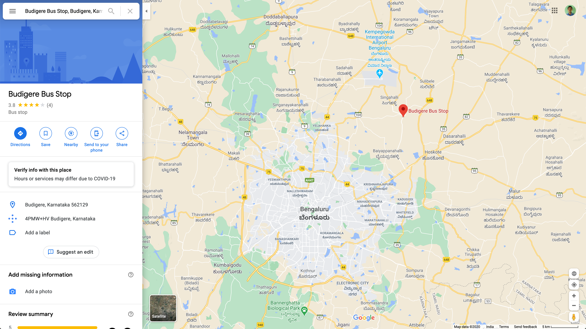
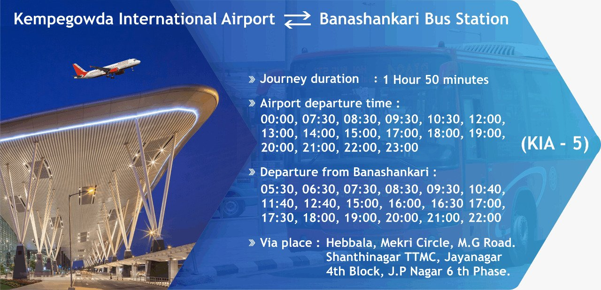

# Transport for Bengaluru: Week 1

### Official BMTC helpline
- Phone: `080 2228 3777`
- Whatsapp: `+91 77609 91212`

Seeing about 25-30 commuters waiting for bus to Devanahalli at Budigere, [`@SathishKumar980`](https://twitter.com/SathishKumar980) messaged the BMTC official Whatsapp number. [BMTC](https://twitter.com/BMTC_BENGALURU) took immediate action and arranged a bus in under `10 minutes`. 👏 Below is the link to the Twitter thread. Thank you Sathish for taking the initiative and congratulations to BMTC for the amazing response!

- https://twitter.com/SathishKumar980/status/1309458062596427776

### KIA-5: BIAL to/from Banashankari
BMTC published departure times between Banashankari Bus Stand and Bengaluru International Airport on Twitter. Made us think about how better we could aggregate bus schedules both from agencies as well as commuters who take them. Below is the link to this tweet:

- https://twitter.com/BMTC_BENGALURU/status/1309851348523839490

#### Virgin Hyperloop and Bangalore International Airport
Virgin Hyperloop and Bangalore International Airport Limited announce ground-breaking partnership to conduct feasibility study. Hyperloop could connect BLR Airport to the city center in about `10 minutes`. More on the official press release at the link below:
- https://www.bengaluruairport.com/corporate/media/news-press-releases/virgin-hyperloop-and-bangalore-international-airport-limited-ann.html